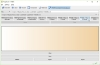

 

<h2>What is Angelcoin:</h2>
<ul>
<li>Complete finished and working mineable cryptocurrency v1.0.0.0 with command-prompt and GUI, supporting OpenCL for x86 and x64 bits Windows OS</li>
<li>Cryptocurrency with integrated 5 coin miners ([CPU], [GPU]), 2 address miners ([CPU], [GPU]) and 2 wallet generators</li>
</ul>

<h2>Why Angelcoin:</h2>
<ul>
<li>5 coin miners (1 internal:oclvanityminer [GPU] and 4 externals: minerd [CPU]; ccminer [GPU]; cgminer [GPU]; bfgminer [GPU]) for ALC and many others cryptocurrencies</li>
<li>2 address miners (vanitygen [CPU]; oclvanitygen [GPU]) for ALC and many others coins</li>
<li>2 address/wallet generators (keyconv; walletgenerator.net) for ALC and many others cryptocoins</li>
<li>Achievable 7 roadmaps in the next 2 to 5 years</li>
</ul>

<h2>Roadmaps:</h2>
<ol>
<li>Authenticator guard for each sending Angelcoin transaction against unauthorized privkey usage</li>
<li>Recover lost privkey from encrypted wallet backup copy placed on firm's security clouds</li>
<li>Legally insured money</li>
<li>Possibility almost entire blockchain to be deleted without losing double spending efficiency or security</li>
<li>No fees for buyer or seller for buying or selling</li>
<li>SegWit (much more work is needed in BTC MainNet to be considered as safe/stable/insured)</li>
<li>Lightning Network (much more work is needed in BTC MainNet to be considered as safe/stable/insured)</li>
</ol>

<h2>Investment opportunities:</h2>
<ol type="I">
<li>Available investment packages:
	<table class="t1">
	<tr><td>a)</td><td>100 ALC</td><td>=</td><td>0.0112 BTC</td></tr>
	<tr><td>b)</td><td>500 ALC</td><td>=</td><td>0.056 BTC</td></tr>
	<tr><td>c)</td><td>1000 ALC</td><td>=</td><td>0.112 BTC</td></tr>
	<tr><td>d)</td><td>5000 ALC</td><td>=</td><td>0.56 BTC</td></tr>
	<tr><td>e)</td><td>10000 ALC</td><td>=</td><td>1.12 BTC</td></tr>
	<tr><td>f)</td><td>50000 ALC</td><td>=</td><td>5.6 BTC</td></tr>
	</table>
</li>
<li>Steps to buy the selected investment package(s):
	<ol>
	<li>Send email to <a href="&#109;&#97;&#105;&#108;&#116;&#111;&#58;&#102;&#117;&#110;&#100;&#64;&#97;&#110;&#103;&#101;&#108;&#99;&#111;&#105;&#110;&#46;&#109;&#111;&#110;&#101;&#121;">&#102;&#117;&#110;&#100;&#64;&#97;&#110;&#103;&#101;&#108;&#99;&#111;&#105;&#110;&#46;&#109;&#111;&#110;&#101;&#121;</a> , containing desired investment package, your ALC address and your BTC address</li>
	<li>You will receive shortly the individual BTC address only for your present/future investments in Angelcoin</li>
	<li>Make the payment</li>
	<li>After at least 6 confirmations in BTC network, you will receive shortly:
		<ul>
		<li>the confirmation email about your BTC payment
		<li>the respective Angelcoin amount in your ALC address
		</ul>
	</li>
	</ol>
</li>
</ol>

<h2>Specifications:</h2>
<table class="t2">
<tr><td>1.</td><td>Name</td><td>Angelcoin</td></tr>
<tr><td>2.</td><td>Ticket</td><td>ALC</td></tr>
<tr><td>3.</td><td>Hashing Algorithm</td><td>Scrypt</td></tr>
<tr><td>4.</td><td>Consensus Mechanism</td><td>Proof of Work</td></tr>
<tr><td>5.</td><td>Total Supply</td><td>1 billion coins</td></tr>
<tr><td>6.</td><td>Premined</td><td>750 millions (75%) coins for ICO, airdrops, rewards, bounties, marketing, encrypted cloud storages, cloud hosting, administration and future development to make the transfer of value completely free and legally insured!</td></tr>
<tr><td>7.</td><td>Mineable</td><td>250 millions (25%) coins for mining by users</td></tr>
<tr><td>8.</td><td>Block Size Limit</td><td>10 MB (2.4GB per 24 hours)</td></tr>
<tr><td>9.</td><td>Block Reward</td><td>1000 ALC per block</td></tr>
<tr><td>10.</td><td>Block Target Time</td><td>6 minutes</td></tr>
<tr><td>11.</td><td>Difficulty Retarget</td><td>2016 blocks</td></tr>
<tr><td>12.</td><td>Difficulty Adjustment</td><td>8.4 days (2016 blocks per 8.4 days)</td></tr>
<tr><td>13.</td><td>Reward Halving Time</td><td>50 K blocks until reward halves (which will occur approximately every 0.57 year or 208.33 days)</td></tr>
<tr><td>14.</td><td>Reward Scheme for the first</td><td>25 millions total ALC, 5000 per block for the first 5000 blocks (from 500 to 4999 blocks)</td></tr>
<tr><td>15.</td><td>Maturity</td><td>100+20 blocks</td></tr>
<tr><td>16.</td><td>Confirmations</td><td>6 blocks</td></tr>
<tr><td>17.</td><td>[MainNet] Address Prefix</td><td>A</td></tr>
<tr><td>18.</td><td>[MainNet] TCP RPC JSON Port</td><td>6332</td></tr>
<tr><td>19.</td><td>[MainNet] TCP P2P Port</td><td>6333</td></tr>
<tr><td>20.</td><td>[TestNet] Address Prefix</td><td>a</td></tr>
<tr><td>21.</td><td>[TestNet] TCP RPC JSON Port</td><td>16332</td></tr>
<tr><td>22.</td><td>[TestNet] TCP P2P Port</td><td>16333</td></tr>
<tr><td>23.</td><td>Creator</td><td><a href="https://angel.co/angelt" target="_blank">Angel T</a></td></tr>
<tr><td>24.</td><td>Birthday</td><td>Thu, 15 Feb 2018 10:28:26 EET 

</td></tr>
<tr><td>25.</td><td>Website</td><td><a href="http://www.angelcoin.money" target="_blank">www.angelcoin.money</a></td></tr>
<tr><td>26.</td><td>[MainNet] Block Explorer</td><td><a href="https://www.angelcoin.money/BlockExplorer/" target="_blank">RPC Ace</a></td></tr>
<tr><td>27.</td><td>[TestNet] Block Explorer</td><td><a href="https://www.angelcoin.money/BlockExplorer-TestNet/" target="_blank">RPC Ace</a></td></tr>
<tr><td>28.</td><td>Announcement</td><td><a href="https://bitcointalk.org/index.php?topic=2961483" target="_blank">BitcoinTalk</a></td></tr>
<tr><td>29.</td><td>Source code</td><td><a href="https://github.com/angelcoinmoney/angelcoin" target="_blank">GitHub</a></td></tr>
<tr><td>30.</td><td>Market Capitalization</td><td>soon</td></tr>
<tr><td>31.</td><td>Exchange</td><td>soon</td></tr>
<tr><td>32.</td><td>Splash Screen</td><td><a href="https://drive.google.com/open?id=1K6d1djC4cR5VCHPqyPx0kg04ucAHTyno" target="_blank"></a></td></tr>
<tr><td>33.</td><td>Splash Screen [MainNet]</td><td><a href="https://drive.google.com/open?id=1PNSkMedPYHXRquzQVJheUGwlvya20HVa" target="_blank"></a></td></tr>
<tr><td>34.</td><td>Splash Screen [TestNet]</td><td><a href="https://drive.google.com/open?id=17aHOH6pXAXp833wNAdhp7JVZ3oJA18bc" target="_blank"></a></td></tr>
<tr><td>35.</td><td>Screenshots:</td><td>
<a href="https://drive.google.com/open?id=1dnrRHobUt24p857LAfyZYuALMJ34VPY7" target="_blank"></a>
<a href="https://drive.google.com/open?id=1-LwvEHhSHIyuLrCi5i81k7n4BqQqAjZU" target="_blank"></a>
<a href="https://drive.google.com/open?id=1XbszM4KxwBoOcsjvHAZABKxohbdmaBmG" target="_blank"></a>
<a href="https://drive.google.com/open?id=1MdOOr33fJF0ck6a7VviAW-anBf76uiN2" target="_blank"></a>
<a href="https://drive.google.com/open?id=1sGGsaiklYSjEHkfWZrT8bRky8NErvDYj" target="_blank"></a>
<a href="https://drive.google.com/open?id=1CiOp8aX8ccFnewt9qN-WYd6c6JUrjee0" target="_blank"></a>
<a href="https://drive.google.com/open?id=1sw21f7NvLXHJzdon2l_gtRJ3ON51X_JW" target="_blank"></a>
<a href="https://drive.google.com/open?id=1hczvw6jeIGuX4rAYu9Lv3_dDkYuKhpz9" target="_blank"></a>
<a href="https://drive.google.com/open?id=175SvF4Vu6x38XJZBBkS_mp1GaMOdF5v5" target="_blank"></a>
<a href="https://drive.google.com/open?id=1EMQS8XppNPfUHV5IMkFQzNUoXxoMoPRI" target="_blank"></a>
<a href="https://drive.google.com/open?id=1hsoELTmdzVgh38y-N8oFPeCxMvi1EU4H" target="_blank"></a>
<a href="https://drive.google.com/open?id=127yiIdLSgTICDtHvjyEtwYXuXE2PBizP" target="_blank"></a>
<a href="https://drive.google.com/open?id=1agSYw-N5jUJ73ZOp-R7YsWmbymYV-PJS" target="_blank"></a>
<a href="https://drive.google.com/open?id=1i-V3izMaMA0ntSlm5rH9KRZz-HZtNbiC" target="_blank"></a>
<a href="https://drive.google.com/open?id=1DkN988aybA5rHFpElAQ9_IXiHZ0s9Mty" target="_blank"></a>
<a href="https://drive.google.com/open?id=1BiC84UDwN48C8gFwhT9bIQKJvkZP9_1B" target="_blank"></a>
<a href="https://drive.google.com/open?id=1eSShgoTpnnv93Zu4QlVsyzpOF0EswChD" target="_blank"></a>
<a href="https://drive.google.com/open?id=1IAjA6tvSTKD-LmrZ430tLF85VfG-_tH3" target="_blank"></a>
<a href="https://drive.google.com/open?id=1NLfhFSYWvY1E5g2WZsctMCvJz-KL7TvA" target="_blank"></a>
<a href="https://drive.google.com/open?id=1nfFI9BejhByieCU7fiNSMkAzoZMmHP2l" target="_blank">SlideShow</a>
</td></tr>
</table>

<h2>Downloads #1 [github]:</h2>
<a href="https://github.com/angelcoinmoney/angelcoin/releases" target="_blank">GitHub Releases</a>

<h2>Downloads #2 [google drive]:</h2>
<table class="t3">
<tr><caption>Portable x64bit versions for Windows OS:</caption></tr>
<tr><td><a href="https://drive.google.com/open?id=1h68hy70cCs0pUY_aWqBVi3BbouVo2yXL" target="_blank">Angelcoin-x64-v1.0.0.0.zip</a></td><td>&#160;<a href="https://drive.google.com/open?id=1dJc_0gkuWRtLZ4meiuGdoGZ473CX96oB" target="_blank">Angelcoin-x64-v1.0.0.0.zip.sha512</a></td><td>&#160;<a href="https://drive.google.com/open?id=1zn6BEpEVDBRV6zqjwz-FG1JXJsFC62NM" target="_blank">Angelcoin-x64-v1.0.0.0-OpenCL.zip</a></td><td>&#160;<a href="https://drive.google.com/open?id=18eoP11YFAlH-WJ3w-62G0YmWIigv8UbZ" target="_blank">Angelcoin-x64-v1.0.0.0-OpenCL.zip.sha512</a></td></tr>
</table>
 
 
<table class="t3">
<tr><caption>Portable x86bit versions for Windows OS:</caption></tr>
<tr><td><a href="https://drive.google.com/open?id=1XDn09ez3rzEYpShnYuIiUCXyB3D_Ph1d" target="_blank">Angelcoin-x86-v1.0.0.0.zip</a></td><td>&#160;<a href="https://drive.google.com/open?id=1IaGpLttLgyKP-kJSHPH15on9oTr_p2IM" target="_blank">Angelcoin-x86-v1.0.0.0.zip.sha512</a></td><td>&#160;<a href="https://drive.google.com/open?id=17SFT-YW4kN--IDRSUKiKERk43EYKLvvM" target="_blank">Angelcoin-x86-v1.0.0.0-OpenCL.zip</a></td><td>&#160;<a href="https://drive.google.com/open?id=1c-rGYmkDSzYeK7ErDAljCyZEsTaqE-Dh" target="_blank">Angelcoin-x86-v1.0.0.0-OpenCL.zip.sha512</a></td></tr>
</table>
 
 
<table class="t3">
<tr><caption>Installation x64bit versions for Windows OS:</caption></tr>
<tr><td><a href="https://drive.google.com/open?id=17JEX6vYKtTjkKJ5wINwUK03kc2sgb0YZ" target="_blank">Angelcoin-x64-v1.0.0.0.exe</a></td><td>&#160;<a href="https://drive.google.com/open?id=1PuJSjAaAaYXjzQ0MD65Ye8vjlQbyQ0ag" target="_blank">Angelcoin-x64-v1.0.0.0.exe.sha512</a></td><td>&#160;<a href="https://drive.google.com/open?id=1agkHU-y3l8FOCig_nWw67Y8I04kGx-Ad" target="_blank">Angelcoin-x64-v1.0.0.0-OpenCL.exe</a></td><td>&#160;<a href="https://drive.google.com/open?id=19ustAIwSNifwgQ__oWplNGjoYu7NymVT" target="_blank">Angelcoin-x64-v1.0.0.0-OpenCL.exe.sha512</a></td></tr>
</table>
 
 
<table class="t3">
<tr><caption>Installation x86bit versions for Windows OS:</caption></tr>
<tr><td><a href="https://drive.google.com/open?id=1FkfVCEUEEXBzF5soBilScmfOrCId014S" target="_blank">Angelcoin-x86-v1.0.0.0.exe</a></td><td>&#160;<a href="https://drive.google.com/open?id=1S8gCYLnKSyHKaEB4EuqbnO5QpukNrqQw" target="_blank">Angelcoin-x86-v1.0.0.0.exe.sha512</a></td><td>&#160;<a href="https://drive.google.com/open?id=1QU7fEM43aK4OG4E5e57zMVIuyied93ki" target="_blank">Angelcoin-x86-v1.0.0.0-OpenCL.exe</a></td><td>&#160;<a href="https://drive.google.com/open?id=193XNxWNDAn-RloqB_DsNKQOmYGOHiJ4T" target="_blank">Angelcoin-x86-v1.0.0.0-OpenCL.exe.sha512</a></td></tr>
</table>

<h2>Setup:</h2>
<ul>
<li>Allow AngelcoinD.exe and AngelcoinQt.exe in your Windows OS firewall</li>
<li>Portable version:
	<ul>
	<li>Start "AngelcoinQt-mainnet.bat" to reach MainNet via GUI</li>
	<li>Start "AngelcoinQt-testnet.bat" to reach TestNet via GUI</li>
	<li>Start "AngelcoinD-mainnet.bat" to reach MainNet via command-prompt</li>
	<li>Start "AngelcoinD-testnet.bat" to reach TestNet via command-prompt</li>
	<li>The path to your portable wallet.dat for MainNet in Windows OS: <i>"&#60;yourextractdirectory&#62;\Angelcoin\"</i></li>
	<li>The path to your portable wallet.dat for TestNet in Windows OS: <i>"&#60;yourextractdirectory&#62;\Angelcoin\testnet3\"</i></li>
	</ul>
</li>
<li>Installation version:
	<ul>
	<li>Start "AngelcoinQt.exe" to reach MainNet via GUI</li>
	<li>Start "AngelcoinQt.exe -testnet" to reach TestNet via GUI</li>
	<li>Start "AngelcoinD.exe" to reach MainNet via command-prompt</li>
	<li>Start "AngelcoinD.exe -testnet" to reach TestNet via command-prompt</li>
	<li>The path to your installation wallet.dat for MainNet in Windows OS: <i>"C:\Users\&#60;username&#62;\AppData\Roaming\Angelcoin\"</i></li>
	<li>The path to your installation wallet.dat for TestNet in Windows OS: <i>"C:\Users\&#60;username&#62;\AppData\Roaming\Angelcoin\testnet3\"</i></li>
	</ul>
</li>
<li>Spectre and Meltdown exploits protection: During works of Angelcoin, close and do not use any other programs, especially browsers like: Internet Explorer, Edge, Chrome, Firefox, Opera, etc.</li>
</ul>

<h2>Contact:</h2>
<ul>
<li> <a href="&#109;&#97;&#105;&#108;&#116;&#111;&#58;&#99;&#111;&#110;&#116;&#97;&#99;&#116;&#64;&#97;&#110;&#103;&#101;&#108;&#99;&#111;&#105;&#110;&#46;&#109;&#111;&#110;&#101;&#121;">&#99;&#111;&#110;&#116;&#97;&#99;&#116;&#64;&#97;&#110;&#103;&#101;&#108;&#99;&#111;&#105;&#110;&#46;&#109;&#111;&#110;&#101;&#121;</a> </li>
</ul>

<h2>Donation:</h2>
<ul>
<li>1ALCdnMP44gyBS6ziLDHypv4bRBxT9TfyR</li>
</ul>
